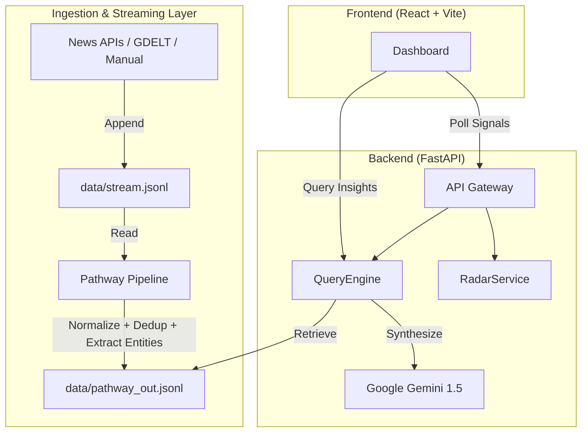

<div align="center">
  <h1>⚡ SiliconPulse</h1>
  <p><b>Real-time Strategic Intelligence for the Semiconductor & AI Ecosystem</b></p>

  [](#)
  [](#)
  [](#)

</div>

---

## 📖 Overview

**SiliconPulse** is an advanced, real-time strategic intelligence engine designed to decode the rapidly evolving semiconductor, AI, and tech startup markets. It autonomously aggregates live signals—from global news, market data, and tech journals—grounds them in verified evidence, and leverages **Google Gemini** to synthesize executive-level strategic insights instantly.

Unlike static dashboards, SiliconPulse is **reactive and intent-aware**. It understands the strategic implications of supply chain disruptions, AI model launches, or sudden funding rounds, and explains *why* it matters, backed by a dynamic confidence assessment and real-time Entity Recognition.

---

## ✨ Key Features

- 📡 **Live Pulse Feed & Ingestion**: A real-time data pipeline that ingests, normalizes, and deduplicates signals on the fly with a 12-hour freshness window.
- 🧠 **Strategic Insight Engine (RAG)**: Powered by Gemini, generating structured reports outlining Immediate Shifts, Impact Reasoning, Competitor Effects, and Strategic Outlooks.
- 🎯 **Universal Company Radar**: Dynamically extracts organizations using robust regex/NLP heuristics to track the pulse of every startup, tech giant, and entity mentioned in the stream—unbound by static dictionaries.
- 💉 **Live Signal Injection**: Manually inject custom intelligence into the live stream and watch the AI instantly adapt its analysis and confidence scoring.
- ✅ **Source Verification & End-to-End Export**: Automated trust-scoring for sources (High/Medium/Low) with justification. Export full intelligence briefings to Markdown, JSON, or Text.
- 🎬 **Cinematic Command Center UI**: High-fidelity React interface featuring atmospheric styling and real-time interactive components.

---

## 🏗️ Architecture

SiliconPulse relies on a highly decoupled architecture designed for streaming data velocity, utilizing **Pathway** for real-time processing and **FastAPI** as the intelligence gateway.



### The Streaming Pipeline (Pathway)
- **Normalization**: Cleanses unstructured text for downstream RAG.
- **Deduplication**: Computes stable SHA-256 fingerprints for events to ensure distinct processing.
- **Universal Entity Extraction**: Employs real-time heuristics to auto-tag organizations across the tech spectrum.

---

## 🚀 Getting Started

### Prerequisites
- **Python 3.11+**
- **Node.js 18+**
- **Google Gemini API Key** (Set as `GEMINI_API_KEY` in `backend/.env`)
- API Keys for News sources (NewsData.io, NewsAPI, GNews, Mediastack) - *Optional but recommended for live streams.*

### Installation & Setup

1. **Clone the repository**
   ```bash
   git clone https://github.com/SanskarG-20/SiliconPulse.git
   cd SiliconPulse
   ```

2. **Backend Setup**
   ```bash
   cd backend
   python -m venv venv
   source venv/bin/activate  # On Windows: .\venv\Scripts\activate
   pip install -r requirements.txt
   ```

3. **Frontend Setup**
   ```bash
   cd frontend
   npm install
   ```

### Running the System

SiliconPulse requires three services to run concurrently for full functionality.

**Terminal 1: Data Pipeline (Pathway)**
```bash
cd backend
python pathway_pipeline.py
```

**Terminal 2: API Server (FastAPI)**
```bash
cd backend
uvicorn app.main:app --reload --port 8000
```

**Terminal 3: UI Dashboard (React)**
```bash
cd frontend
npm run dev
```
Navigate to `http://localhost:5173` to access the Command Center.

> **Windows Users**: We provide one-click powershell scripts in the respective directories (`run_pathway.ps1`, `run_backend.ps1`, `run_frontend.ps1`) for convenience.

---

## 🧪 Testing & Verification

Run the automated smoke tests to ensure your backend environment and RAG integrations are functioning correctly:

```bash
cd backend
export PYTHONPATH="."  # On Windows: $env:PYTHONPATH="."
pytest tests/test_smoke.py
```

Check backend health:
```bash
curl http://localhost:8000/health
```

---

## 🛠️ Tech Stack

- **Frontend**: React 18, Vite, Tailwind CSS, Lucide Icons, Framer Motion
- **Backend**: FastAPI, Uvicorn, APScheduler, Python `re` (Heuristics)
- **Data Processing**: Pathway
- **AI / LLM**: Google Gemini (1.5 Flash / Pro)
- **Storage**: JSONL (Streaming), SQLite (Metadata)

---

## 🔮 Roadmap

- [ ] **Graph RAG**: Map multi-tiered supply chain dependencies (e.g., ASML -> TSMC -> NVIDIA) for deep-tier impact analysis.
- [ ] **Multi-Modal Ingestion**: Parse PDF earnings reports and financial charts automatically.
- [ ] **Distributed Streaming**: Scale to multiple Pathway workers to support 1M+ event ingestion per day.

---

## 📄 License

Distributed under the MIT License. See `LICENSE` for more information.

---
<div align="center">
  Built with ❤️ using Google Gemini, Pathway & FastAPI.
</div>
